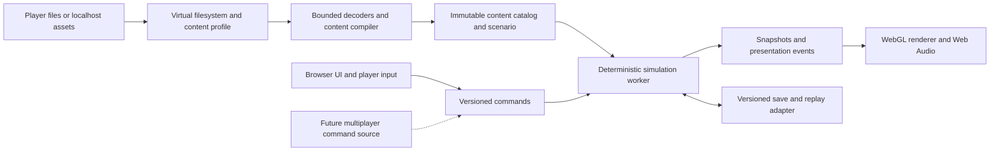

# Proposed architecture

Status: design for implementation, not existing modules. Product constraints are in
[decisions.md](decisions.md); delivery gates are in [plan.md](plan.md).

## Runtime and dependency direction

The application composes these modules. Simulation depends only on deterministic
contracts and compiled content types, never browser/UI/network implementations.
Workers decode assets outside the render loop; simulation never pauses halfway
through a tick to await a file. Preload required behavior data before starting a
scenario. Missing decorative/media data follows explicit presentation rules.

## Proposed package boundaries and ownership

| Path | Responsibility | Write owner role |
| --- | --- | --- |
| `packages/contracts/` | IDs, commands, compiled scenario types, snapshots, errors, save/replay versions | Coordinator |
| `packages/vfs/`, `packages/formats/`, `packages/content/` | Byte ranges, archives/codecs, INI/CSF, mount precedence, content validation | Content worker |
| `packages/sim/` | Tick state, units, locomotion, combat, economy, visibility, RNG | Simulation worker |
| `packages/campaign/` | Pure trigger/script/team/AI systems composed into the simulation | Campaign worker |
| `packages/render/`, `packages/audio/` | Terrain/sprites/voxels, scene/UI rendering, sound/video | Presentation worker |
| `apps/web/`, `tools/local-launcher/` | Import, settings, campaign flow, storage, local serving | Application worker |
| `tests/fixtures/`, `tests/scenarios/`, `tests/browser/` | Original synthetic fixtures, replay traces, browser flows | Assigned feature owner; independent review |
| `tools/analysis/`, `docs/analysis/` | Metadata-only analysis and reference provenance | Evidence worker |
| `local/` | Ignored reference assets, extracts, native saves, recordings, private reports | Assigned researcher; never distributed |

These are ownership roles rotated across three workers, not eight concurrent agents.
Do not create empty packages simply to match this table. Introduce boundaries when
the first working slice requires them. Current triage tooling remains at
`tools/static_inventory.py` until there is a reason to move it.

## Import, filesystem, and content profiles

Two entry paths share a `readRange(assetId, offset, length)` abstraction:

1. **Hosted browser:** user selects a game folder, asset files, or an asset ZIP. Read
   locally using File/Blob APIs. Prefer streaming/range access and bounded caches;
   provide progress, cancel/resume, space estimates, validation, and actionable
   missing-file diagnostics. Detect missing YR/base dependencies and distinguish
   full-campaign readiness from optional music/bonus-map coverage.
2. **Local package:** launcher serves engine files and an allowlisted asset directory
   over loopback. No Windows executable is required. Normalize paths, reject traversal
   and symlink escape, validate Host/origin, disable arbitrary directory exposure,
   and use stable local origin/port behavior so saves do not disappear unexpectedly.
   Support range requests and a one-command start on desktop operating systems.

An “assets only” set may retain MIX containers or contain supported extracted files;
it need not contain executables, serials, storefront tools, PDFs, caches, or DLLs.
Define minimum manifests per game, mission, theater, language, and media feature in
M0/M1. Full-install import ignores unrelated files. Corrupt or unsupported inputs
must fail with named files and remediation, not a generic failed load.

Keep an immutable content manifest with stable IDs, byte lengths/hashes, archive
origin/member identity, game profile, language, ordered mod layers, and diagnostics.
Case folding, path normalization, hashed-name collisions, duplicate loose files,
patch order, and INI duplicate/override behavior must be explicit and tested.
Do not guess RA2/YR precedence from one third-party implementation.

Use OPFS where suitable and an IndexedDB/File-Blob fallback as needed by tested
capabilities. Keep assets, derived caches, saves, and preferences logically separate;
never treat origin storage as the only backup for saves. Storage quota and eviction
are browser-managed; support storage estimates, persistent-storage requests, export,
reimport, and recovery. See [OPFS](https://developer.mozilla.org/en-US/docs/Web/API/File_System_API/Origin_private_file_system)
and [storage quotas](https://developer.mozilla.org/en-US/docs/Web/API/Storage_API/Storage_quotas_and_eviction_criteria).

No game asset bytes or content-bearing crash dumps go to servers/analytics. Test
that boundary through network interception. Ship a self-contained engine package;
offline local play is required, and browser reload offline after caching is a release
test. Version caches and service-worker updates with the save/content compatibility
policy. Imported files are never part of the app's public build inputs.

## Formats and media

Plan support for MIX variants and nested indexes, INI/map files and packed sections,
CSF strings, PAL palettes, SHP sprites, TMP terrain, VXL/HVA voxels/animation,
audio BAG/IDX and applicable WAV/AUD codecs, and actual movie formats discovered in
the census. “Planned” is not proof every variant occurs in this installation.

All readers use bounded byte views, validate lengths/offsets/dimensions/counts, cap
decompressed sizes and recursion, and reject oversized resource claims. Preserve
unknown fields in diagnostic/round-trip representations where feasible; compiled
runtime content must report unsupported behavior before a mission begins.

Cinematics are a release requirement. M0 evaluates licensed browser-side decode
versus on-device conversion, including startup delay, A/V sync, subtitles, seek/skip,
memory, and Traditional Chinese presentation. A localhost conversion helper may be
an optimization, but cannot be the sole solution for the hosted browser importer.
If FFmpeg is considered, audit the exact build configuration and dependencies;
[its licensing varies with enabled components](https://www.ffmpeg.org/legal.html).
Do not ship the Windows Bink DLL or distribute converted retail movie files.

For localized assets, decode CSF and any legacy text encodings based on evidence,
retain fallback diagnostics, and use redistributable/system CJK fonts where needed.
Translate the app shell for the playable locale set. Test clipping, punctuation,
line wrapping, objective text, save names, hotkeys, and subtitles. A multilingual
manual folder is not a list of installed in-game language packs.

## Deterministic simulation

Use a fixed logical tick, an explicitly configured speed mapping, stable entity IDs,
seeded versioned RNG streams, defined iteration/scheduling order, and consistent
numeric rounding/overflow rules. Decide tick rate and numeric representation from
reference evidence and tests; do not guess them from renderer frame rate.

All orders, including local UI commands, enter a queue with tick, player, sequence,
kind, and serializable payload. Validate commands in simulation. AI and triggers
use the same internal order semantics; ordered mutations have a documented phase.
Define movement/path tie-breaks, targeting ties, simultaneous damage/death, spawn
allocation, and deferred-event ordering. Workers must not race on simulation state.

Every authoritative state component is explicit: entity/component data, terrain
changes, house relationships, credits/power/build queues, visibility, scripts/teams,
triggers, variables, timers, RNG, scheduled actions, objective and campaign state.
Avoid nonserializable closures for delayed gameplay actions. Rendering interpolation,
audio clocks, UI selection, GPU resources, and filesystem handles remain outside it.

Portable contracts, deterministic tests, and command logs reduce later multiplayer
changes. They do not solve transport, authority, jitter, cheating, reconnect, or
cross-version compatibility. Exact compatibility with the original RNG is a separate
claim from WebRA2 reproducing its own replay on four browser engines.

## Campaign interpreter and AI

Compile the original mission data into typed tables that retain source provenance.
Implement event predicates, action dispatch, enable/disable/delete operations,
one-shot/repeating and linked triggers, tags/cell tags, local/global variables,
timers, teams, task forces, scripts, house changes, reinforcements, camera/media,
objectives, win/loss, and campaign progression. Generate the implementation order
from a full opcode census and each selected mission's dependency closure.

Separate scenario trigger evaluation, scripted team behavior, and strategic AI.
Campaign AI includes recruitment, base plans, production, resource behavior, repair,
threat response, attacks, and mission-specific rules; a generic skirmish bot cannot
substitute for original scripts. Trace predicate changes, action firing, recruitment,
script PCs, and objective state for debugging and reference comparisons.

RA2/YR profiles select differences in rules/defaults and supported mechanics. Keep
YR features represented in contracts early, with capability flags for unimplemented
systems. Prevent a RA2 load from accidentally using expansion defaults. Unknown
campaign-essential opcodes block a “supported mission” claim.

## Rendering, controls, and audio

Start with WebGL2 terrain/SHP/PAL rendering and verified screen-to-cell picking.
Add VXL/HVA, body/turret/barrel transforms, normals, palette remap, isometric depth,
elevation/cliffs/bridges, shadows, lighting, water, terrain changes, particles,
projectiles, fog/shroud, animations, and UI overlays. Render only information allowed
by the player's view. Simulation does not derive line of sight or collision from
pixels, GPU picking, animation duration, or variable frame rate.

Provide camera scrolling, selection/box selection, contextual orders, control groups,
hotkeys, minimap, build sidebar, power/credits, mission objectives, pause/speed,
save/load, accessibility labels for shell controls, remappable keys, sound/subtitle
settings, and display scaling. Match familiar original controls by default, with
optional modern controls later. Web Audio handles voice/music/effects with explicit
user-gesture start, pause/resume, pooling, and bounded resource use.

## Saves, replays, and mods

WebRA2 saves include schema/engine version, profile and content/mod fingerprints,
all authoritative simulation state, campaign progress, and replay/checkpoint linkage.
Write transactionally; retain a previous good save; export/import without embedding
retail assets. Give clear mismatch and migration errors. Saving at any allowed tick
and resuming must yield the same subsequent state/events as uninterrupted execution.

Replays contain initial seed/content identity plus versioned command streams and
periodic canonical state hashes. Tests compare uninterrupted, replayed, and restored
state across browser engines. Treat imported original Windows saves as a separate
adapter and feasibility study, never as the internal runtime persistence format.

Initial mods use original maps, rules/art/AI INIs, supported archives/assets, and a
small WebRA2 manifest that records identity, version, dependencies and capabilities.
Preserve legacy load semantics; define explicit conflict/load-order diagnostics for
stacking mods. No `eval`, unrestricted JS, or native DLL execution. Save/replay
fingerprints include ordered mods and detect incompatible content before loading.
Later scripted mods need a versioned deterministic capability API, resource budgets,
and a separate security model; extension mods require named semantic coverage.
