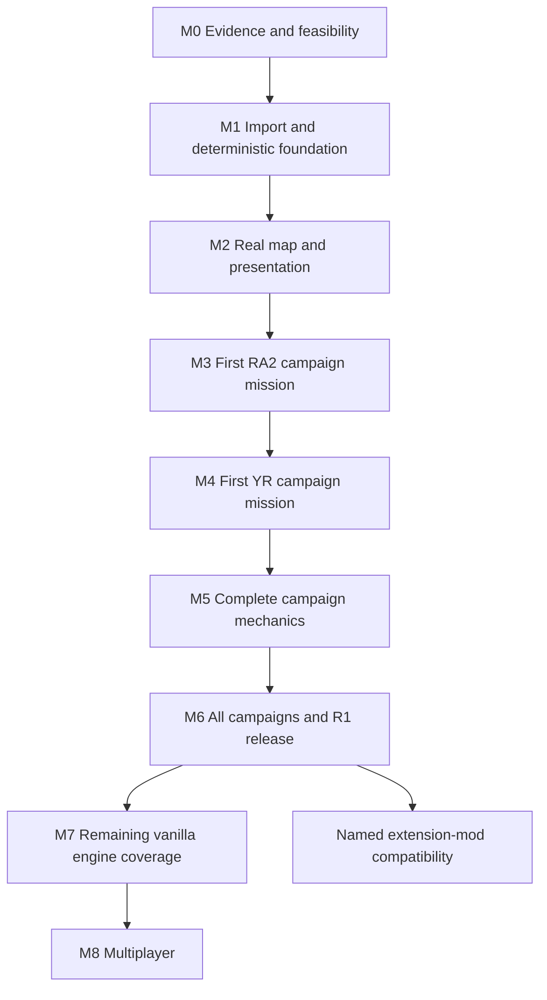

# Campaign-first implementation and agent collaboration plan

Status: accepted by the owner; M0 implementation is underway. The first tooling,
archive, specification and browser/media slices are merged. Read the
[current handoff](task.md) for completed work, active ownership and remaining gates.
Read [decisions](decisions.md), [architecture](architecture.md), and
[static evidence](analysis/static-analysis.md) together with this plan.

## Outcome and scope

Build an independently runnable browser game engine that consumes player-supplied
Red Alert 2 / Yuri's Revenge content. Ship a hosted engine-only application and an
offline-capable localhost package. Assets remain on the player's device.

The first campaign release, **R1**, supports all four original RA2/YR faction campaign
tracks, their required mechanics and AI, cinematics/audio/objectives, WebRA2 saves,
and all playable languages present in the supplied Steam installation. Traditional
Chinese is a primary acceptance locale. Desktop Chrome, Edge, Firefox, and Safari
are release targets. Internal single-mission builds are milestones, not R1.

Vanilla maps, INI rules, and replacement assets are R1 mod scope. Original Windows
save import is best effort, separately reported. Full vanilla engine coverage
including features outside campaign usage continues after R1. Ares/Phobos extension
mods, mobile, original-network interoperability, and multiplayer services are later
work; they are not implied by a successful R1 release.

Do not forecast a full-engine finish date from this triage. Measure completed
vertical slices, opcode closure, reference discrepancies, and browser performance,
then forecast remaining work. Multiple agents help independent subsystems; they do
not eliminate unknown behavior or integration cost.

## Critical path and milestone dependencies



M0's media and storage feasibility work runs alongside archive analysis. Synthetic
simulation and renderer foundations can proceed before every archive is decoded.
Once required contracts are frozen, independent feature tasks may overlap milestone
work. Gates below still apply; parallel activity must not hide an unmet dependency.

## M0 — Establish the content and behavior baseline

Entry: the current metadata inventory and owner decisions. This milestone is active.

1. **M0-01: content/VFS evidence.** Choose or implement the MIX reader. Identify
   classic/flagged/encrypted indexes, checksums, hashed filenames, nested archives,
   patch order and loose-file behavior. Pin the Steam installation hashes. Determine
   effective RA2/YR versions through evidence, not the `1.08`/`1.11` string labels.
   Produce a metadata-only member inventory and required/optional import manifests.
2. **M0-02: campaign census.** Enumerate and deduplicate original missions, identify
   opening and continuation files and victory/defeat media, map all event/action/
   script opcodes and parameters to missions. Include map rule overrides, houses,
   teams, AI, theaters, assets, and language dependencies. Mark unresolved names.
3. **M0-03: behavior specification.** Define an evidence schema and initial opcode,
   tick/order, RNG, and save-state specs. Use licensed format/editor sources and
   targeted static analysis; identify assumptions needing original-game comparison.
   Prepare small reproducible observation recipes for the owner.
4. **M0-04: browser/media feasibility.** Demonstrate a bounded local file read,
   representative CJK string rendering, one terrain/sprite/voxel sample where decoded,
   and a candidate cinematic decode/conversion path. Measure load time and memory in
   the four browser families. Synthetic placeholders do not close real-codec gates.
5. **M0-05: dependency and contract decisions.** Select exact dependency versions,
   code licenses/notices, toolchain, package layout, save/command boundary, and
   performance measurement hardware. Compare targeted reuse with new implementations.
   GPL is allowed; no full engine migration is presumed by that permission.

Exit: verifiable content manifests and mission dependency graph; explicit unsupported
formats/opcodes; candidate browser-compatible media path; pinned dependency/license
decisions; first RA2 and YR slice selection; initial shared contracts; original-game
comparison plan. Record failures with bounded next investigations. Do not move a
blocked codec into an untracked “we will solve it later” item.

Existing implementations worth a bounded comparison are documented in
[the static analysis references](analysis/static-analysis.md). OpenRA/EA editor code
may help formats; Chrono Divide establishes feasibility but its SDK is not an engine
reuse grant. Engine compatibility must be tested against this project's requirements.

## M1 — Import, content profiles, and simulation foundation

- Scaffold TypeScript packages and an application shell with reproducible dependency
  locks and documented commands. Add tests using original synthetic content.
- Implement range-based local file/ZIP/folder import, indexed VFS, RA2/YR profile
  separation, INI/CSF/rule compilation, provenance, validation and missing-file UI.
- Add browser-local storage, quota/cancel/error handling, content fingerprints,
  private asset test configuration, and initial loopback launcher.
- Build headless tick loop, stable entity IDs, versioned commands, seeded RNG,
  deterministic ordering/numerics, scheduled events, state hashes and replay logs.
- Implement WebRA2 save/restore at the state-model level now, including pending
  commands, events and RNG; expose minimal shell save/load/export/import.
- Establish public CI without retail content and opt-in local integration commands.

Exit: a synthetic scenario survives save/reload and replay with identical hashes;
real supplied files import on all target browsers, including failure/cancel paths;
network tests show no asset upload; RA2/YR content layers cannot cross-contaminate.
Document exact scripts. Do not claim a playable campaign at this stage.

## M2 — Display and inspect a real mission

- Decode terrain/map packs and object placement; implement palettes, SHP/TMP and
  VXL/HVA assets, tile/elevation/depth handling, map camera, zoom and cell picking.
- Display neutral objects, buildings/units, shadows, remap, lighting and visibility
  from snapshots. Add sidebar/minimap/selection/controls with synthetic orders.
- Integrate voice/music/effects and a real cinematic path with subtitles and skip.
- Add a development inspector for entity state, content sources and mission tables;
  keep developer internals out of normal player flows.

Exit: selected RA2 and YR missions render from the user's assets; terrain/object
alignment and picking are checked; Traditional Chinese text and media are legible;
memory remains bounded; four-browser rendering/input evidence is recorded. No
mission-completion claim follows from rendering alone.

## M3 — Finish one original RA2 mission end to end

- Implement the first mission's complete dependency closure: movement/pathfinding,
  occupancy, combat/projectiles/damage/death, capture/garrison or other needed
  interactions, scripted teams, trigger events/actions, objectives and outcomes.
- Implement exact source mission loading and progression through the common
  interpreter. Do not replace the mission with a handcrafted approximation.
- Include scenario AI and non-player houses, reinforcements, camera/media timing,
  failure paths, restart, difficulty parameters, audio and presentation.
- Compare owner-provided original-game observations. Fix semantic discrepancies;
  document deliberate deviations and their effect on playability.

Exit: legitimate start-to-victory and start-to-defeat runs; save during active mission
and resume with equivalent outcomes; no unimplemented required opcodes; cinematic
and progression flow; verified commands/controls; reference evidence for important
mission events; unattended deterministic regression scenario. A debug win button
or fabricated command script that bypasses gameplay does not satisfy this gate.

## M4 — Finish one original Yuri's Revenge mission

- Implement its dependency closure using the explicit YR profile and shared systems.
  Likely candidates include mind-control ownership, transformations/deployments,
  special transports or time-related mission actions; the M0 census decides the list.
- Extend capability contracts intentionally and maintain the M3 RA2 regression.
- Cover base/expansion/patch asset precedence, theater differences, voices/subtitles,
  new AI/trigger semantics, and saved mission state.

Exit: the same end-to-end gates as M3, including save/replay equivalence and original
reference comparison. This catches an RA2-only design before spreading it to every
mission. Native Windows save import can be investigated in a spare bounded slice;
its failure must not block WebRA2 persistence or silently become a release promise.

## M5 — Close the campaign mechanics inventory

Implement by dependency clusters, with synthetic behavior probes plus a real mission
using each system. See [compatibility.md](compatibility.md) for the live checklist.

| Cluster | Representative scope to verify against the census |
| --- | --- |
| Movement/world | Ground/naval/air/hover/amphibious/subterranean where used, crushing, slopes/bridges, terrain destruction, occupancy/path replanning, transports |
| Economy/building | Ore/gems, harvest/refine/unload, credits, production/prerequisites/queues, placement/foundations, deploy/undeploy, power/radar, repair/sell/capture |
| Combat | Weapons/warheads/projectiles, armor/range/ROF, splash, elevation, cover/garrison, veterancy, healing, repair, damage/death ordering |
| Special mechanics | Engineers/spies/disguise, terror drones, radiation, chrono/iron-curtain/weather/nuclear effects, aircraft carriers/missiles, cloak/detection, naval interactions |
| YR-specific | Mind control and release/ownership, psychic systems, magnetron/gattling mechanics, slave economy, grinders, cloning, transformations and attached/passenger behavior as encountered |
| AI/campaign | Recruitment/teams/scripts, conditions, construction plans, threat and attacks, mission rules and triggers, diplomacy, local/global variables, difficulty and progression |
| Presentation | All encountered theaters, palettes/normals/animations, special effects, cursor/sidebar/minimap states, voice/subtitles/cinematics and game speed |

Exit: all mechanics/opcodes needed by the complete campaign manifest are implemented
and covered. All required resource types decode; unsupported content is diagnosed.
Measure simulation cost, renderer frame time, load time and peak memory on agreed
hardware. Adjust implementation from profiling rather than migrating to WASM by habit.

## M6 — Full campaign verification and R1

- Drive every original campaign mission through supported difficulties with recorded
  win/loss/objective/progression evidence. Include optional objectives, alternate
  outcomes, unexpected player sequences and save points around timed transitions.
- Verify all playable language packs actually present in this Steam installation.
  Test missing packs, fallback text, CJK UI and subtitles, localized save names, and
  the shell language choice. Do not infer asset language support from manuals.
- Exercise original-format map/INI/asset mods, precedence/conflicts, dependencies,
  disable/re-enable, restart, and save/replay mismatch diagnostics.
- Finish durable save transactions/migrations, export/import, cache eviction recovery,
  offline reload, directory permission loss, asset reimport, update compatibility,
  missing/corrupt files, WebGL context recovery, focus/audio transitions and long play.
- Validate hosted engine-only and localhost packages across browsers/desktop OSes;
  measure install/import/startup experience. Run full network and package-content
  audits; ensure no private assets/saves/recordings leak into CI or distributions.
- Publish a concrete support matrix, known deviations, reproducible private test
  recipes, dependency notices and measured performance. No hosting deployment is
  authorized merely by writing this roadmap.

Exit/R1: all campaign-required compatibility rows are VERIFIED, all campaign test
cases have evidence, and the release checklist is green. Unknown/unsupported required
semantics or inaccessible reference gates remain visible release blockers. Clearly
label any original-save import status separately. A human player can import their
files, choose a campaign, play, save/quit/resume, and finish through the normal UI.

## M7 — Complete the vanilla engine beyond campaign usage

Use the full rules/AI/assets inventory to cover units, weapons, theaters, game modes,
skirmish AI, map options and mechanics not exercised by campaign missions. Add
synthetic and representative-map tests for the remaining combinations. Provide
modder documentation and diagnostics; validate a small agreed corpus of independent
vanilla mods. Completion means the vanilla feature inventory is closed, with
explicit deviations, not an unlimited promise to support arbitrary extensions.

In a separate branch of the roadmap, choose named Ares/Phobos versions/mod targets,
inventory the semantics they require, and implement a versioned compatibility layer.
Treat this as behavior implementation, not loading a Windows DLL into the browser.

## M8 — Multiplayer design and implementation

First gather requirements for player counts, modes/co-op, lobby/accounts, hosting,
server costs and interoperability. Reuse command streams, canonical saves/hashes,
content fingerprints, headless simulation and deterministic replay as the foundation.
Select transport and authority/lockstep model after latency/desync prototypes.

Implement session/lobby negotiation, peer content compatibility, ordering and input
delay, reconnect/resync, spectators/replays, desync diagnostics, rate limits and abuse
handling. Test packet delay/loss/reordering/disconnects, mixed browser engines and
long sessions. Preserve campaign regressions. Networking remains substantial work;
this architecture reduces avoidable simulation rewrites rather than promising none.

## Four-agent operating model

The owner accepted **one coordinator plus three workers**. A role is an assignment
for a wave; it is not a permanent additional agent. Use fewer workers when dependencies
or integration work leave no useful independent task.

| Wave | Coordinator | Worker A | Worker B | Worker C |
| --- | --- | --- | --- | --- |
| M0 | Decision ledger, shared evidence/contracts, integration | Archives/content census | Behavior/campaign specs; synthetic reference probes | Browser/media/localization and dependency feasibility |
| M1 | Root toolchain/contracts, CI and end-to-end review | VFS/formats/content pipeline | Deterministic sim/save/replay | Import shell/storage/localhost |
| M2 | Integrate/profile and assign shared types | Remaining formats/assets | Headless world/selection/command behavior | Renderer/audio/controls |
| M3–M4 | Reference comparisons, contract changes, merge gates | Campaign interpreter/AI | Required simulation mechanics | Presentation and complete player flow |
| M5 | Prioritize mission dependency closure | Assigned independent mechanic cluster | Another independent cluster | Mission integration/regression review |
| M6 | Release evidence and integration | Campaign/reference verification | Browser/storage/import/replay verification | Mods/localization/media/performance verification |

In M5, mechanically independent work must also have non-overlapping write paths.
Two agents editing the same combat/ownership system are not independent simply
because their tasks have different names. Reassign or serialize them.

## Task contract, merge rules, and refreshed sessions

Use the GitHub integration or `gh` CLI throughout the
[GitHub workflow](github-workflow.md). Each substantive slice has a GitHub issue,
linked branch/PR, recorded independent agent review, and verified merge. GitHub is
the shared work/review history; `docs/task.md` is the local resume index into it.
This applies to documentation and research as well as implementation.
Workers commit coherent increments during implementation. Genuine blockers become
linked GitHub issues with evidence and attempted remedies; continue independent
work and involve the owner only when essential input/access/reference evidence is
unavailable. Follow the detailed blocker protocol in `github-workflow.md`.

Before dispatch, the coordinator creates or reuses an issue with a bounded task record:

```text
ID / milestone / objective:
GitHub issue URL / parent issue / dependency issue URLs:
Owner and exclusive write paths:
Branch / PR URL (when created):
Input revisions and required interfaces:
Dependencies and assumptions:
Deliverables and explicit non-goals:
Acceptance tests and private reference requirements:
Return: changed files, exact commands/results, evidence, limitations, next dependency,
        PR and review URLs, reviewed head SHA, and merge SHA if merged.
```

The coordinator owns `packages/contracts/`, root config/lockfiles and `docs/task.md`.
Workers submit interface proposals; no agent silently expands a public schema.
Freeze a small contract revision before dependent workers implement against it.
An accepted schema change includes migration impact and all consumer updates.

Prefer independent worktrees/`codex/` branches for longer concurrent slices. When
agents share a checkout, enforce exclusive write paths and do not run competing
dependency installs or Git mutations. Review diffs before integrating; preserve user
edits. No worker copies private assets into its commit or reports full game payloads.

Each merge needs relevant tests, provenance, compatibility-row updates and a short
review by the coordinator or a worker who did not implement it. Keep changes small
enough to run the integration scenario after every merge. Failing shared tests block
dependent merges. Retire/reassign workers rather than leaving speculative branches
to accumulate. Never claim mocks/synthetic fixtures verified a retail mission.
Post the actual review on GitHub with the reviewer role, reviewed commit and findings.
The coordinator merges the reviewed revision through the integration or `gh`, after
applicable checks and repository review rules pass; do not bypass those rules or
treat shared-account agent comments as independent GitHub account approvals.

At the end of each session, `docs/task.md` records the active/completed slice, owners,
branches/contracts, issue/PR/review URLs, merged commit or outstanding merge status,
changes, exact validation, evidence paths, blockers, and the next bounded action.
A fresh agent can continue from repository files without this chat.
Do not start all queued roadmap tasks when asked merely to resume the current slice.

## Evidence and testing policy

- **Public unit/property tests:** original tiny format fixtures, corrupt input bounds,
  decompression limits, INI semantics, deterministic primitives and isolated mechanics.
- **Public headless scenarios:** command→state/event behavior; save/resume/replay
  equivalence; RNG/tick ordering; trigger/team/AI scheduling; numeric edge cases.
- **Browser flows:** import/cancel/error/recovery, controls, objectives, audio/media,
  persistence/relaunch/offline, CJK localization and actual Safari verification.
  Browser automation library selection happens with the toolchain; a WebKit test
  harness is useful but does not replace a real Safari release run.
- **Private asset tests:** local authorized retail files, representative renderer/
  codec checks and complete campaign paths; use fingerprints and metadata reports.
  Owner-provided recordings/saves stay under `local/` with scenario/build notes.
- **Reference comparisons:** compare observable mission events/outcomes and bounded
  mechanics to the original. Compare WebRA2 state hashes only to WebRA2 runs; original
  engine memory/state is not assumed to share our representation.
- **Performance and distribution:** representative large missions, load/peak memory,
  tick/frame percentiles, cache budgets, package contents, license notices and no
  unexpected network transfer. Set numeric gates on actual agreed hardware in M0.

Evidence record fields: ID, source/build/content hash, archive/member/offset or INI
section, observed fact, interpretation, confidence, implementation/test references,
verification status and deviation. Track OBSERVED, SPECIFIED, IMPLEMENTED and VERIFIED
separately. Use UNKNOWN/BLOCKED honestly where no evidence closes the claim.

## Main risks and responses

| Risk | Early evidence / response |
| --- | --- |
| Encrypted indexes and unknown names hide content dependencies | M0 full bounded MIX reader and manifest before broad mechanics work |
| Patched/localized assets differ from assumed retail versions | Hash profiles, user provenance and locale census; never rely on version strings alone |
| Mission triggers/AI appear to work but fail later missions | Opcode-to-mission matrix, trace interpreter, synthetic probes and original comparisons |
| Browser cinematics are slow, unavailable or license-incompatible | M0 real-sample media spike and pinned dependency/build decision |
| Save/restore misses timers, ownership or script state | Deterministic save/replay gates starting in M1 and repeated for each mechanic |
| RA2/YR differences cause pervasive exceptions | Separate profiles and an early real YR mission in M4 |
| Import duplicates gigabytes or loses saves on eviction | Range reads, cache budgets, export/restore, quota and offline recovery tests |
| Four agents diverge on interfaces or own the same files | Frozen contracts, exclusive paths, coordinator-owned shared changes and frequent integration |
| “Full engine” expands without a measurable finish | Complete inventory with explicit compatibility tiers and named unsupported extensions |
| Static evidence leaves behavior uncertain | Owner observation recipes and small targeted follow-ups; do not label uncertain behavior verified |
